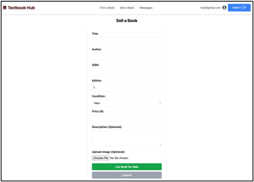

# Vite + React + Tailwind CSS

This is a simple React project built using [Vite](https://vitejs.dev/) and styled with [Tailwind CSS](https://tailwindcss.com/).

## 📦 Installation

Make sure you have **Node.js** installed, then follow these steps:

1. Clone the repository (if applicable) or navigate to the project folder.
2. Install dependencies:

   ```bash
   npm install
   ```

## 🚀 Running the Project

To start the development server:

```bash
npm run dev
```

This will launch the app at **http://localhost:5173/** by default.

## 🔧 Building for Production

To create an optimized production build:

```bash
npm run build
```

To preview the production build locally:

```bash
npm run preview
```

## 🎨 Tailwind CSS

This project is styled with Tailwind CSS. If you need to modify styles, update `tailwind.config.js` or use Tailwind classes in your components.

### Tailwind Directives (Located in `src/index.css`):

```css
@tailwind base;
@tailwind components;
@tailwind utilities;
```

## ✅ Additional Commands

- **Lint code:** `npm run lint`
- **Format code (if using Prettier):** `npm run format`

---

## Maneuvering the User Interface

### 1. Login Page
  
This is the user login interface, where users enter their credentials to access the platform. The user has 
the ability to create an account on this page if they don't already have one. Simple email and password
are all that is needed.

### 2. Main Page
  
After logging in, users are taken to the main page where they can browse, search, or post textbooks. They 
can also add a book to their favorites by hitting the heart (like) icon. 

### 3. Messages Feature
  
Users can send and receive messages about textbook listings through this messaging interface.

### 4. Sell Textbook Button
  
A dedicated button lets users quickly navigate to the form for posting textbooks for sale.

### 5. Sell Textbook Form
  
This form allows users to enter details like title, author, and price to list a textbook for sale.


Built with ❤️ using **Vite, React, and Tailwind CSS**.
